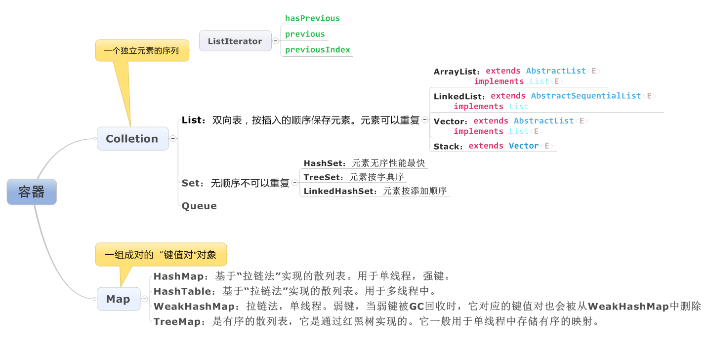

# Java容器类

Java容器类是java提供的工具包，包含了常用的数据结构：集合、链表、队列、栈、数组、映射等。从本文开始将开启一个系列详细分析Java容器中的每个成员，包括源代码分析，性能分析，不同容器之间对比等等。

Java容器主要可以划分为4个部分：List列表、Set集合、Map映射、工具类（Iterator迭代器、Enumeration枚举类、Arrays和Collections）

## 容器类框架


通过上图，可以把握两个基本主体，即Collection和Map。


* Collection是一个接口，是高度抽象出来的集合，它包含了集合的基本操作和属性。Collection包含了List和Set两大分支。

* List是一个有序的队列，每一个元素都有它的索引。第一个元素的索引值是0。List的实现类有LinkedList, ArrayList, Vector, Stack。

* Set是一个不允许有重复元素的集合。 Set的实现类有HastSet和TreeSet。HashSet依赖于HashMap，它实际上是通过HashMap实现的；TreeSet依赖于TreeMap，它实际上是通过TreeMap实现的。

* Map是一个映射接口，即key-value键值对。Map中的每一个元素包含“一个key”和“key对应的value”。

* AbstractMap是个抽象类，它实现了Map接口中的大部分API。而HashMap，TreeMap，WeakHashMap都是继承于AbstractMap。

* Hashtable虽然继承于Dictionary，但它实现了Map接口。

* Iterator是遍历集合的工具，即我们通常通过Iterator迭代器来遍历集合。我们说Collection依赖于Iterator，是因为Collection的实现类都要实现iterator()函数，返回一个Iterator对象。ListIterator是专门为遍历List而存在的。

* Enumeration是JDK 1.0引入的抽象类。作用和Iterator一样，也是遍历集合；但是Enumeration的功能要比Iterator少。在上面的框图中，Enumeration只能在Hashtable, Vector, Stack中使用。

* Arrays和Collections是操作数组、集合的两个工具类。

有了上面的整体框架之后，我们接下来对每个类分别进行分析。

## Collection接口

```
public interface Collection<E> extends Iterable<E> {}
```

它是一个接口，是高度抽象出来的集合，它包含了集合的基本操作：添加、删除、清空、遍历(读取)、是否为空、获取大小、是否保护某元素等等。

在Java中所有实现了Collection接口的类都必须提供两套标准的构造函数，一个是无参，用于创建一个空的Collection，一个是带有Collection参数的有参构造函数，用于创建一个新的Collection，这个新的Collection与传入进来的Collection具备相同的元素。

Collection的API：
```
abstract boolean         add(E object)
abstract boolean         addAll(Collection<? extends E> collection)
abstract void            clear()
abstract boolean         contains(Object object)
abstract boolean         containsAll(Collection<?> collection)
abstract boolean         equals(Object object)
abstract int             hashCode()
abstract boolean         isEmpty()
abstract Iterator<E>     iterator()
abstract boolean         remove(Object object)
abstract boolean         removeAll(Collection<?> collection)
abstract boolean         retainAll(Collection<?> collection)
abstract int             size()
abstract <T> T[]         toArray(T[] array)
abstract Object[]        toArray()
```

## List接口

```
public interface List<E> extends Collection<E> {}
```

List是一个继承于Collection的接口，即List是集合中的一种。List是有序的队列，List中的每一个元素都有一个索引；第一个元素的索引值是0，往后的元素的索引值依次+1。和Set不同，List中允许有重复的元素。

>官方文档：A List is a collection which maintains an ordering for its elements. Every element in the List has an index. Each element can thus be accessed by its index, with the first index being zero. Normally, Lists allow duplicate elements, as compared to Sets, where elements have to be unique.

关于API方面。既然List是继承于Collection接口，它自然就包含了Collection中的全部函数接口；由于List是有序队列，它也额外的有自己的API接口。主要有“添加、删除、获取、修改指定位置的元素”、“获取List中的子队列”等。

```
// Collection的API
abstract boolean         add(E object)
abstract boolean         addAll(Collection<? extends E> collection)
abstract void            clear()
abstract boolean         contains(Object object)
abstract boolean         containsAll(Collection<?> collection)
abstract boolean         equals(Object object)
abstract int             hashCode()
abstract boolean         isEmpty()
abstract Iterator<E>     iterator()
abstract boolean         remove(Object object)
abstract boolean         removeAll(Collection<?> collection)
abstract boolean         retainAll(Collection<?> collection)
abstract int             size()
abstract <T> T[]         toArray(T[] array)
abstract Object[]        toArray()
// 相比与Collection，List新增的API：
abstract void                add(int location, E object)
abstract boolean             addAll(int location, Collection<? extends E> collection)
abstract E                   get(int location)
abstract int                 indexOf(Object object)
abstract int                 lastIndexOf(Object object)
abstract ListIterator<E>     listIterator(int location)
abstract ListIterator<E>     listIterator()
abstract E                   remove(int location)
abstract E                   set(int location, E object)
abstract List<E>             subList(int start, int end)
```

实现List接口的集合主要有：ArrayList、LinkedList、Vector、Stack。

### ArrayList

```
public class ArrayList<E> extends AbstractList<E>
implements List<E>, RandomAccess, Cloneable, java.io.Serializable
```

ArrayList是一个动态数组，也是我们最常用的集合。它允许任何符合规则的元素插入甚至包括null。每一个ArrayList都有一个初始容量：

```
private static final int DEFAULT_CAPACITY = 10;
```

随着容器中的元素不断增加，容器的大小也会随着增加。在每次向容器中增加元素的同时都会进行容量检查，当快溢出时，就会进行扩容操作。所以如果我们明确所插入元素的多少，最好指定一个初始容量值，避免过多的进行扩容操作而浪费时间、效率。

size、isEmpty、get、set、iterator 和 listIterator 操作都以固定时间运行。add 操作以分摊的固定时间运行，也就是说，添加 n 个元素需要 O(n) 时间（由于要考虑到扩容，所以这不只是添加元素会带来分摊固定时间开销那样简单）。

ArrayList擅长于随机访问。同时ArrayList是非同步的。

### LinkedList

```
public class LinkedList<E> extends AbstractSequentialList<E>
implements List<E>, Deque<E>, Cloneable, java.io.Serializable
```

同样实现List接口的LinkedList与ArrayList不同，ArrayList是一个动态数组，而LinkedList是一个双向链表。所以它除了有ArrayList的基本操作方法外还额外提供了get，remove，insert方法在LinkedList的首部或尾部。

由于实现的方式不同，LinkedList不能随机访问，它所有的操作都是要按照双重链表的需要执行。在列表中索引的操作将从开头或结尾遍历列表（从靠近指定索引的一端，节约一半时间）。这样做的好处就是可以通过较低的代价在List中进行插入和删除操作。

与ArrayList一样，LinkedList也是非同步的。如果多个线程同时访问一个List，则必须自己实现访问同步。一种解决方法是在创建List时构造一个同步的List：

```
List list = Collections.synchronizedList(new LinkedList(…));
```

### Vector

```
public class Vector<E> extends AbstractList<E>
implements List<E>, RandomAccess, Cloneable, java.io.Serializable
```

与ArrayList相似，但是Vector是同步的。所以说Vector是线程安全的动态数组。它的操作与ArrayList几乎一样。

### Stack

```
public class Stack<E> extends Vector<E> {}
```

Stack继承自Vector，实现一个后进先出的堆栈。Stack提供5个额外的方法使得Vector得以被当作堆栈使用。基本的push和pop方法，还有peek方法得到栈顶的元素，empty方法测试堆栈是否为空，search方法检测一个元素在堆栈中的位置。Stack刚创建后是空栈。

## Set接口

```
public interface Set<E> extends Collection<E> {}
```

Set是一个继承于Collection的接口，Set是一种不包括重复元素的Collection。它维持它自己的内部排序，所以随机访问没有任何意义。与List一样，它同样运行null的存在但是仅有一个。由于Set接口的特殊性，所有传入Set集合中的元素都必须不同，

关于API方面。Set的API和Collection完全一样。

实现了Set接口的集合有：HashSet、TreeSet、LinkedHashSet、EnumSet。

### HashSet
```
public class HashSet<E> extends AbstractSet<E>
implements Set<E>, Cloneable, java.io.Serializable
```

HashSet堪称查询速度最快的集合，因为其内部是以HashCode来实现的。集合元素可以是null,但只能放入一个null。它内部元素的顺序是由哈希码来决定的，所以它不保证set的迭代顺序；特别是它不保证该顺序恒久不变。

### TreeSet

```
public class TreeSet<E> extends AbstractSet<E>
implements NavigableSet<E>, Cloneable, java.io.Serializable
```

TreeSet是二叉树实现的，基于TreeMap，生成一个总是处于排序状态的set，内部以TreeMap来实现，不允许放入null值。它是使用元素的自然顺序对元素进行排序，或者根据创建Set时提供的 Comparator 进行排序，具体取决于使用的构造方法。

### LinkedHashSet

```
public class LinkedHashSet<E> extends HashSet<E>
implements Set<E>, Cloneable, java.io.Serializable
```

LinkedHashSet集合同样是根据元素的hashCode值来决定元素的存储位置，但是它同时使用链表维护元素的次序。这样使得元素看起 来像是以插入顺序保存的，也就是说，当遍历该集合时候，LinkedHashSet将会以元素的添加顺序访问集合的元素。LinkedHashSet在迭代访问Set中的全部元素时，性能比HashSet好，但是插入时性能稍微逊色于HashSet。

### EnumSet

```
public abstract class EnumSet<E extends Enum<E>> extends AbstractSet<E>
implements Cloneable, java.io.Serializable
```

EnumSet中所有值都必须是指定枚举类型的值，它的元素也是有序的，以枚举值在枚举类的定义顺序来决定集合元素的顺序。EnumSet集合不允许加入null元素，否则会抛出NullPointerException异常。EnumSet类没有暴露任何构造器来创建该类的实例，程序应该通过它提供的static方法来创建EnumSet对象，例如：

```
public static void main(String[] args) {

        //创建一个EnumSet空集合，指定其集合元素是season1的枚举值
		EnumSet<MyEnum>eSet1 = EnumSet.noneOf(MyEnum.class); 
		
		////创建一个EnumSet集合，集合元素就是Season里的全部枚举值
		EnumSet<MyEnum>eSet2 = EnumSet.allOf(MyEnum.class);
	}
	
	enum MyEnum {  
	    BLACK, WHITE, RED, BLUR, GREEN, YELLOW  
	}
```

来看一个例子感受一下存储元素的区别：

```
static Collection fill(Collection<String> collection) {
		collection.add("rat");
		collection.add("cat");
		collection.add("dog");
		collection.add("dog");
		return collection;
	}

	public static void main(String[] args) {
		System.out.println(fill(new HashSet<String>()));
		System.out.println(fill(new TreeSet<>()));
		System.out.println(fill(new LinkedHashSet<>()));
	}
```

HashSet是哈希表实现的，存储顺序并无意义。如果存储顺序很重要，那么可以使用TreeSet，它按比较结果的升序保存对象；或者使用LinkedHashSet，它按照被添加的顺序保存元素。当然它们都是线程不安全的。

```
//Result:
[rat, cat, dog]
[cat, dog, rat]
[rat, cat, dog]
```

## Map接口

Map与List、Set接口不同，它是由一系列键值对组成的集合，提供了key到Value的映射。在Map中它保证了key与value之间的一一对应关系。也就是说一个key对应一个value，所以它不能存在相同的key值，当然value值可以相同。
实现map的集合有：HashMap、HashTable、TreeMap、WeakHashMap。

### HashMap

```
public class HashMap<K,V> extends AbstractMap<K,V>
implements Map<K,V>, Cloneable, Serializable
```

以哈希表数据结构实现，查找对象时通过哈希函数计算其位置，它是为快速查询而设计的，其内部定义了一个hash表数组（Entry[] table），元素会通过哈希转换函数将元素的哈希地址转换成数组中存放的索引，如果有冲突，则使用散列链表的形式将所有相同哈希地址的元素串起来，可能通过查看HashMap.Entry的源码它是一个单链表结构。

### HashTable

```
public class Hashtable<K,V> extends Dictionary<K,V>
implements Map<K,V>, Cloneable, java.io.Serializable
```
也是以哈希表数据结构实现的，解决冲突时与HashMap也一样也是采用了散列链表的形式。HashTable继承Dictionary类，实现Map接口。其中Dictionary类是任何可将键映射到相应值的类（如 Hashtable）的抽象父类。每个键和每个值都是一个对象。在任何一个 Dictionary 对象中，每个键至多与一个值相关联。Map是”key-value键值对”接口。 HashTable采用”拉链法”实现哈希表不过性能比HashMap要低。

### TreeMap

```
public class TreeMap<K,V> extends AbstractMap<K,V>
implements NavigableMap<K,V>, Cloneable, java.io.Serializable
```
有序散列表，实现SortedMap接口，底层通过红黑树实现。


### WeakHashMap

```
public class WeakHashMap<K,V> extends AbstractMap<K,V>
implements Map<K,V>
```

谈WeakHashMap前先看一下Java中的引用（强度依次递减）

* 强引用：普遍对象声明的引用，存在便不会GC
* 软引用：有用但并非必须，发生内存溢出前，二次回收
* 弱引用：只能生存到下次GC之前，无论是否内存足够
* 虚引用：唯一目的是在这个对象被GC时能收到一个系统通知

以弱键实现的基于哈希表的Map。在 WeakHashMap 中，当某个键不再正常使用时，将自动移除其条目。更精确地说，对于一个给定的键，其映射的存在并不阻止垃圾回收器对该键的丢弃，这就使该键成为可终止的，被终止，然后被回收。丢弃某个键时，其条目从映射中有效地移除，因此，该类的行为与其他的 Map 实现有所不同。null值和null键都被支持。该类具有与HashMap类相似的性能特征,并具有相同的效能参数初始容量和加载因子。像大多数集合类一样，该类是不同步的。


## Iterator

```
public interface Iterator<E> {}
```

Iterator是一个接口，它是集合的迭代器。集合可以通过Iterator去遍历集合中的元素。Iterator提供的API接口，包括：是否存在下一个元素、获取下一个元素、删除当前元素。
注意：Iterator遍历Collection时，是fail-fast机制的。即，当某一个线程A通过iterator去遍历某集合的过程中，若该集合的内容被其他线程所改变了；那么线程A访问集合时，就会抛出ConcurrentModificationException异常，产生fail-fast事件。关于fail-fast的详细内容，我们会在后面专门进行说明。

```
abstract boolean hasNext()
abstract E next()
abstract void remove()
```



