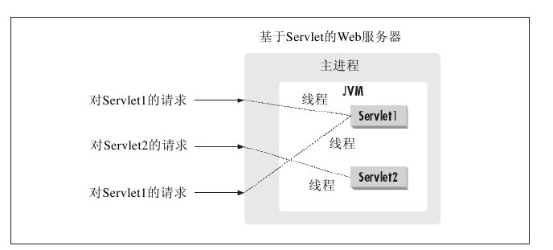

# Servlet的基本架构

## Servlet工作原理

Servlet运行与基于Java的Web服务器中，可以动态的扩展服务器的功能，并采用请求——响应模式提供Web服务。

Servlet的主要功能是提供交互式的浏览和修改数据的能力，并生成动态Web页面。Servlet首先接收来自客户端的请求，将处理结果以动态网页的形式返回客户端浏览器，以浏览器——服务器方式工作。其工作原理如下：

* 客户端浏览器发送请求至Web服务器。
* Web服务器将请求信息发送至Servlet。
* Servlet生成响应内容，并将结果返回给Web服务器。响应的内容通常根据客户端的请求来动态生成。
* Web服务器将响应结果返回给客户端浏览器。

Servlet运行在由Servlet引擎管理的JVM（Java Virtual Machine, Java虚拟机）中，通过它导入特定的属于Java Servlet API的包。Servlet不像CGI那样需要为每一个请求都创建对应的新进程，在JVM中只需要装载一个Servlet就可以处理所有的请求，每个新的请求只使用内存中同一个Servlet的一个线程。

## Servlet接口

在Servlet中最重要的接口就是Servlet接口（Servlet Interface），所有的Servlet都需要执行此接口。Servlet接口提供了Servlet与客户端联系的方法。当Servlet接收来自客户端的调用请求时，它接收两个对象，即ServletRequest和ServletResponse。ServletRequest和ServletResponse接口允许直接与Web服务器通信。

ServletRequest接口可以获取发自客户端的信息，如名称、客户端使用的通信协议、产生请求并接收请求的服务器远端主机名以及提供获取数据流的方法等。一个ServletRequest接口可以让Servlet获取更多的协议特性数据。
 
ServletResponse接口给出相应的客户端的Servlet方法，它允许Servlet设置内容长度和回应的MIME类型。通过使用getWriter（）方法（返回文本数据）或getOutputStream（）方法（返回二进制数据）返回相应的数据。

### HTTPServlet API

Servlet方法
HttpServlet类是一个抽象类，要创建一个HTTP Servlet，需要通过从HttpServlet类派生一个扩展子类来实现，该类是用专门的方法来处理HTML表单数据的GenericServlet的一个子类。HttpServlet类包含init（）、destroy（）、service（）等方法。其中init（）和destroy（）方法是继承的。

#### init（）方法
在Servlet的生命期中，仅执行一次init（）方法。它是在服务器装入Servlet时执行的，可以配置服务器，以在启动服务器或客户机首次访问Servlet时装入Servlet，无论有多少客户机访问Servlet，都不会重复执行init（）。

#### service（）方法
service（）方法是Servlet的核心。当访问Web站点的客户端浏览器向Web服务器发送请求后，Web服务器将请求转发给HTTP Servlet, HTTP Servlet将处理后的响应结果返回给服务器，服务器再将响应结果发送给客户端浏览器。每当客户请求一个HttpServlet对象时，该对象的service（）方法就要被调用，而且传递给这个方法一个“请求”（ServletRequest）对象和一个“响应”（ServletResponse）对象作为参数。在HttpServlet中已存在service（）方法。默认的服务功能是调用与HTTP请求的方法相应的do功能。例如，如果HTTP的请求方法为GET，则默认情况下就调用doGet（）。Servlet应该为HTTP方法重载do功能。因为service（）方法会检查请求方法是否调用了适当的处理方法，因此不必重载该方法，而只需重载相应的do方法就可以了。表19.1中列出了HTTP Servlet子类在应用中经常需要重载的方法。

#### destroy（）方法
destroy（）方法仅执行一次，即在服务器停止且卸装Servlet时执行该方法。典型的情况是，将Servlet作为服务器进程的一部分来关闭。默认的destroy（）方法通常是符合要求的，但也可以覆盖它，典型的是管理服务器端资源。例如，如果Servlet在运行时会累计统计数据，则可以编写一个destroy（）方法，该方法用于在未装入Servlet时将统计数字保存在文件中。另一个示例是关闭数据库链接。

#### GetServletConfig（）方法
GetServletConfig（）方法返回一个ServletConfig对象，该对象用来返回初始化参数和ServletContext。ServletContext接口提供有关Servlet的环境信息。

#### GetServletInfo（）方法
GetServletInfo（）方法是一个可选的方法，它提供有关Servlet的信息，如作者、版本、版权。当服务器调用Servlet的Service（）、doGet（）和doPost（）这3个方法时，均需要“请求”和“响应”对象作为参数。“请求”对象提供有关请求的信息，而“响应”对象提供了一个将响应信息返回给浏览器的通信途径。javax.servlet软件包中的相关类为ServletResponse和ServletRequest，而在javax.servlet.http软件包中的相关类为HttpServletRequest和HttpServletResponse。Servlet通过这些对象与服务器通信并最终与客户机通信。Servlet能通过调用“请求（request）”对象的方法获知客户机环境、服务器环境的信息和所有由客户机提供的信息。Servlet可以调用“响应”对象的方法发送响应，该响应是准备发回客户机的。

#### 常用重载方法

* doGet
* doPost
* doPut
* doDelete

