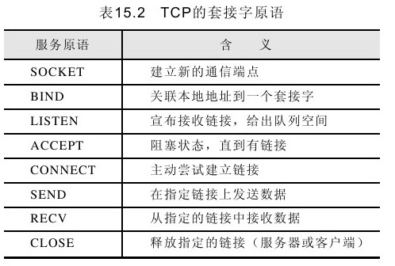

<!-- toc -->
#  Socket及其语言

ocket概念来源于Berkeley UNIX中使用的TCP socket（套接字），可以把它看做一个通信实体，负责完成位于不同主机上的应用程序间通信。该套接字提供了一组原语（一组最基本的操作），保证客户端和服务器端顺利地建立通信链接并传输数据，最后释放链接。这组原语已经广泛应用在网络程序设计中。理解了这组原语对于理解客户/服务器通信过程的建立和释放很有帮助。表15.2列出了8个原语。

其中前4个原语由服务器按照表中声明的顺序依次调用。SOCKET调用创建了新的通信端点，即新的套接字，但是此时它没有网络地址，所以调用BIND原语为套接字绑定网络地址，一旦绑定成功，客户端就可以同服务器建立链接。继续调用LISTEN原语，该原语为进来的链接请求建立排队空间。此时的LISTEN调用不会阻塞服务器进程，所以服务器继续调用ACCEPT原语，当客户端发出了一个链接请求，则服务器端停止阻塞，创建与该客户端链接的一个新Socket。此时服务器可以启动一个新线程来处理刚刚建立的客户端与服务器端的Socket链接，而服务器继续等待新的链接。

客户端同样也使用SOCKET原语创建一个套接字，而后调用CONNECT原语负责调用，并主动发起对服务器的链接，一旦CONNECT调用完成，客户进程与服务器建立了链接。此时双方就可以使用SEND和RECV在建立的链接上进行通信。

建立套接字的双方对称地释放链接，允许一方关闭Socket，此时说明它不再发送数据但是可以接收数据，当双方都调用了CLOSE原语后，该通信链接释放。

在Java中，提供了3种套接字类，以满足用户编写网络程序的需要。它们分别是java.net.Socket、java.net.ServerSocket和java.net.DatagramSocket。其中Socket和ServerSocket是建立在TCP可靠链接基础上的，而DatagramSocket是建立在不可靠的UDP协议上的。

