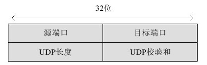

# UDP协议
 
UDP（User Datagram Protocol）协议称为用户数据报协议。该协议运行在TCP/IP模型的传输层，协议可以直接封装成IP分组，不需要事先建立连接就可以发送这些封装好的IP分组。

一个UDP报文由两个端口（即源机器端口和目的机器端口）、UDP长度和UDP校验和组成。通过目的端口，目的主机的传输层就知道把该报文递交给哪个处理进程，而源端口直到从目标主机返回的UDP报文到达源主机后才可以正确地提交给上层进程处理。

UDP数据段由8字节的头部和净荷部分组成，净荷中包含要传输的真实数据。UDP头部信息如图15.8所示。

UDP协议不考虑流量控制、差错控制和损坏数据处理，即使收到的是受损的数据也不要求发送端重传。所有上述问题都要求应用层软件处理。但是，因为它是无连接的协议，所以也不需要事先建立连接，从而节约了建立连接的时间。另外，其传输数据是异步的，使得数据能够及时地发送到网络上，减少了数据处理和传输的时延。

在客户/服务器通信模式下，如果客户给服务器发送的数据很短，而服务器返回的信息也很短，即使这里的请求或应答丢失，客户也会因为超时而重新申请，只要网络是可用的，总有成功通信的可能。而且在网络环境不是很差的条件下，这种方式会工作得很好。而其对于语音或视频通信而言，采用UDP协议是很好的选择，因为这些应用都对实时性要求很高，偶尔丢失数据影响不大。如RFC1889描述的RTP（Real-time Transport Protocol）实时传输协议就是应用UDP协议的典型例子。RTP运行在UDP之上。
由于UDP协议在传输数据时是不可靠的，如果应用层要求接收正确的数据，就需要做很多工作，如数据乱序、数据丢失等。

由于采用UDP协议是无链接的，所以客户端和服务器是相对的概念。因为二者没有一一对应关系，在发送数据前不需要和对方建立链接，所以采用UDP协议通信的双方都可以称为服务器。

