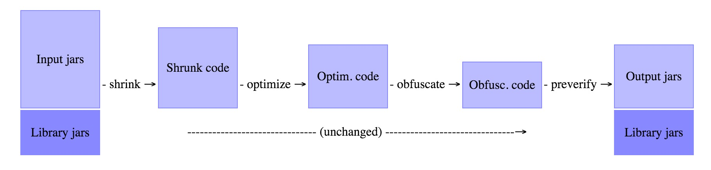

<!-- toc -->

# ProGuard工作原理简介

ProGuard能够对Java类中的代码进行压缩（Shrink）,优化（Optimize）,混淆（Obfuscate）,预检（Preveirfy）。 
1. 压缩（Shrink）:在压缩处理这一步中，用于检测和删除没有使用的类，字段，方法和属性。 
2. 优化（Optimize）:在优化处理这一步中，对字节码进行优化，并且移除无用指令。 
3. 混淆（Obfuscate）:在混淆处理这一步中，使用a,b,c等无意义的名称，对类，字段和方法进行重命名。 
4. 预检（Preveirfy）:在预检这一步中，主要是在Java平台上对处理后的代码进行预检。 
对于ProGuard执行流程图如下图所示。 

