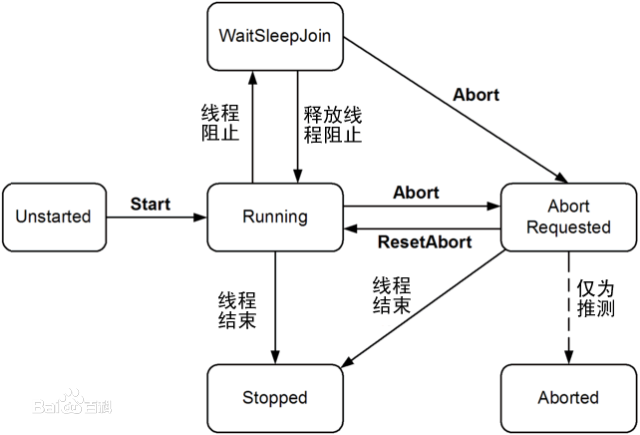
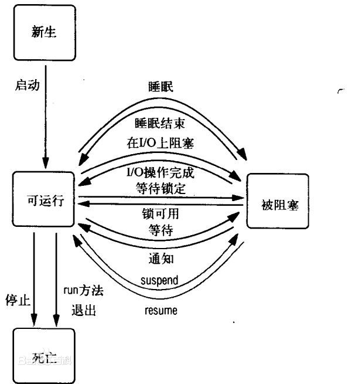
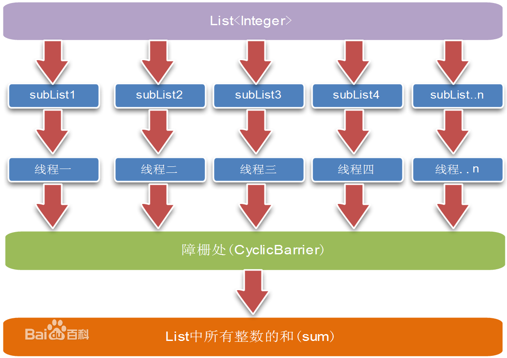
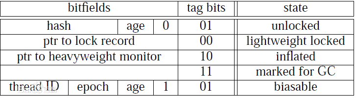
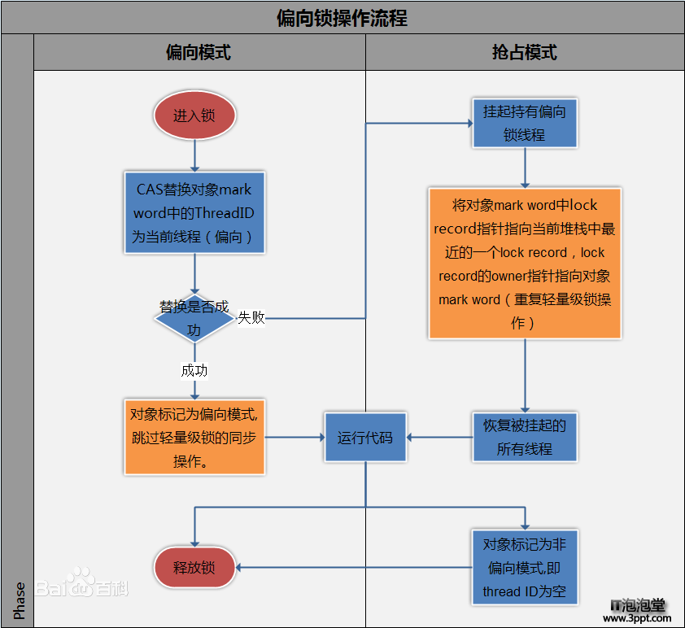

<!-- toc -->
#  线程

## 介绍
线程，有时被称为轻量级进程(Lightweight Process，LWP），是程序执行流的最小单元。

一个标准的线程由线程ID，当前指令指针(PC），寄存器集合和堆栈组成。

另外，线程是进程中的一个实体，是被系统独立调度和分派的基本单位，线程自己不拥有系统资源，只拥有一点儿在运行中必不可少的资源，但它可与同属一个进程的其它线程共享进程所拥有的全部资源。

一个线程可以创建和撤消另一个线程，同一进程中的多个线程之间可以并发执行。

由于线程之间的相互制约，致使线程在运行中呈现出间断性。

线程也有就绪、阻塞和运行三种基本状态。

* 就绪状态是指线程具备运行的所有条件，逻辑上可以运行，在等待处理机；

* 运行状态是指线程占有处理机正在运行；

* 阻塞状态是指线程在等待一个事件（如某个信号量），逻辑上不可执行。

每一个程序都至少有一个线程，若程序只有一个线程，那就是程序本身。

线程是程序中一个单一的顺序控制流程。

进程内一个相对独立的、可调度的执行单元，是系统独立调度和分派CPU的基本单位指运行中的程序的调度单位。
在单个程序中同时运行多个线程完成不同的工作，称为多线程。

## 特点

在多线程OS中，通常是在一个进程中包括多个线程，每个线程都是作为利用CPU的基本单位，是花费最小开销的实体。线程具有以下属性。
### 轻型实体
线程中的实体基本上不拥有系统资源，只是有一点必不可少的、能保证独立运行的资源。
线程的实体包括程序、数据和TCB。线程是动态概念，它的动态特性由线程控制块TCB（Thread Control Block）描述。TCB包括以下信息：

* 线程状态。
* 当线程不运行时，被保存的现场资源。
* 一组执行堆栈。
* 存放每个线程的局部变量主存区。
* 访问同一个进程中的主存和其它资源。
用于指示被执行指令序列的程序计数器、保留局部变量、少数状态参数和返回地址等的一组寄存器和堆栈。

### 独立调度和分派的基本单位
在多线程OS中，线程是能独立运行的基本单位，因而也是独立调度和分派的基本单位。由于线程很“轻”，故线程的切换非常迅速且开销小（在同一进程中的）。
### 可并发执行
在一个进程中的多个线程之间，可以并发执行，甚至允许在一个进程中所有线程都能并发执行；同样，不同进程中的线程也能并发执行，充分利用和发挥了处理机与外围设备并行工作的能力。
### 共享进程资源
在同一进程中的各个线程，都可以共享该进程所拥有的资源，这首先表现在：所有线程都具有相同的地址空间（进程的地址空间），这意味着，线程可以访问该地址空间的每一个虚地址；此外，还可以访问进程所拥有的已打开文件、定时器、信号量机构等。由于同一个进程内的线程共享内存和文件，所以线程之间互相通信不必调用内核。

## 与进程比较

进程是资源分配的基本单位。所有与该进程有关的资源，都被记录在进程控制块PCB中。以表示该进程拥有这些资源或正在使用它们。

另外，进程也是抢占处理机的调度单位，它拥有一个完整的虚拟地址空间。当进程发生调度时，不同的进程拥有不同的虚拟地址空间，而同一进程内的不同线程共享同一地址空间。

与进程相对应，线程与资源分配无关，它属于某一个进程，并与进程内的其他线程一起共享进程的资源。

线程只由相关堆栈（系统栈或用户栈）寄存器和线程控制表TCB组成。

寄存器可被用来存储线程内的局部变量，但不能存储其他线程的相关变量。

通常在一个进程中可以包含若干个线程，它们可以利用进程所拥有的资源。

在引入线程的操作系统中，通常都是把进程作为分配资源的基本单位，而把线程作为独立运行和独立调度的基本单位。

由于线程比进程更小，基本上不拥有系统资源，故对它的调度所付出的开销就会小得多，能更高效的提高系统内多个程序间并发执行的程度，从而显著提高系统资源的利用率和吞吐量。

因而近年来推出的通用操作系统都引入了线程，以便进一步提高系统的并发性，并把它视为现代操作系统的一个重要指标。

线程与进程的区别可以归纳为以下4点：

* 地址空间和其它资源（如打开文件）：进程间相互独立，同一进程的各线程间共享。某进程内的线程在其它进程不可见。
* 通信：进程间通信IPC，线程间可以直接读写进程数据段（如全局变量）来进行通信——需要进程同步和互斥手段的辅助，以保证数据的一致性。
* 调度和切换：线程上下文切换比进程上下文切换要快得多。
* 在多线程OS中，进程不是一个可执行的实体。

## 守护线程

守护线程是特殊的线程，一般用于在后台为其他线程提供服务.
Java中，isDaemon()：判断一个线程是否为守护线程.
Java中，setDaemon()：设置一个线程为守护线程.

## 线程的同步

线程的同步是Java多线程编程的难点，往往开发者搞不清楚什么是竞争资源、什么时候需要考虑同步，怎么同步等等问题，当然，这些问题没有很明确的答案，但有些原则问题需要考虑，是否有竞争资源被同时改动的问题？对于同步，在具体的Java代码中需要完成以下两个操作：把竞争访问的资源标识为private；同步哪些修改变量的代码，使用synchronized关键字同步方法或代码。当然这不是唯一控制并发安全的途径。synchronized关键字使用说明synchronized只能标记非抽象的方法，不能标识成员变量。为了演示同步方法的使用，构建了一个信用卡账户，起初信用额为100w，然后模拟透支、存款等多个操作。显然银行账户User对象是个竞争资源，而多个并发操作的是账户方法oper(int x），当然应该在此方法上加上同步，并将账户的余额设为私有变量，禁止直接访问。

### 工作原理

* 线程是进程中的实体，一个进程可以拥有多个线程，一个线程必须有一个父进程。线程不拥有系统资源，只有运行必须的一些数据结构；它与父进程的其它线程共享该进程所拥有的全部资源。线程可以创建和撤消线程，从而实现程序的并发执行。一般，线程具有就绪、阻塞和运行三种基本状态。

* 在多中央处理器的系统里，不同线程可以同时在不同的中央处理器上运行，甚至当它们属于同一个进程时也是如此。大多数支持多处理器的操作系统都提供编程接口来让进程可以控制自己的线程与各处理器之间的关联度（affinity）。

* 有时候，线程也称作轻量级进程。就象进程一样，线程在程序中是独立的、并发的执行路径，每个线程有它自己的堆栈、自己的程序计数器和自己的局部变量。但是，与分隔的进程相比，进程中的线程之间的隔离程度要小。它们共享内存、文件句柄和其它每个进程应有的状态。

* 进程可以支持多个线程，它们看似同时执行，但互相之间并不同步。一个进程中的多个线程共享相同的内存地址空间，这就意味着它们可以访问相同的变量和对象，而且它们从同一堆中分配对象。尽管这让线程之间共享信息变得更容易，但您必须小心，确保它们不会妨碍同一进程里的其它线程。

* Java 线程工具和 API看似简单。但是，编写有效使用线程的复杂程序并不十分容易。因为有多个线程共存在相同的内存空间中并共享相同的变量，所以您必须小心，确保您的线程不会互相干扰。

### 线程属性
为了正确有效地使用线程，必须理解线程的各个方面并了解Java 实时系统。必须知道如何提供线程体、线程的生命周期、实时系统如 何调度线程、线程组、什么是幽灵线程（Demo nThread）。

### 线程体
所有的操作都发生在线程体中，在Java中线程体是从Thread类继承的run（）方法，或实现Runnable接口的类中的run（）方法。当线程产生并初始化后，实时系统调用它的run（）方法。run（）方法内的代码实现所产生线程的行为，它是线程的主要部分。

### 线程的状态
附图表示了线程在它的生命周期内的任何时刻所能处的状态以及引起状态改变的方法。这图并不是完整的有限状态图，但基本概括了线程中比较感兴趣和普遍的方面。以下讨论有关线程生命周期以此为据。

#### 新线程态（New Thread)
产生一个Thread对象就生成一个新线程。当线程处于"新线程"状态时，仅仅是一个空线程对象，它还没有分配到系统资源。因此只能启动或终止它。任何其他操作都会引发异常。例如，一个线程调用了new方法之后，并在调用start方法之前的处于新线程状态，可以调用start和stop方法。

#### 可运行态（Runnable)
start（）方法产生运行线程所必须的资源，调度线程执行，并且调用线程的run（）方法。

在这时线程的生命状态与周期线程处于可运行态。

该状态不称为运行态是因为这时的线程并不总是一直占用处理机。

特别是对于只有一个处理机的PC而言，任何时刻只能有一个处于可运行态的线程占用处理机。

Java通过调度来实现多线程对处理机的共享。注意，如果线程处于Runnable状态，它也有可能不在运行，这是因为还有优先级和调度问题。

#### 阻塞/非运行态（Not Runnable)
当以下事件发生时，线程进入非运行态。

#### 线程

1. suspend()方法被调用；
2. sleep()方法被调用；
3. 线程使用wait()来等待条件变量；
4. 线程处于I/O请求的等待。

#### 死亡态（Dead)
当run（）方法返回，或别的线程调用stop（）方法，线程进入死亡态。通常Applet使用它的stop（）方法来终止它产生的所有线程。

线程的基本操作：

* 派生：线程在进程内派生出来，它即可由进程派生，也可由线程派生。
* 阻塞（Block）：如果一个线程在执行过程中需要等待某个事件发生，则被阻塞。
* 激活（unblock）：如果阻塞线程的事件发生，则该线程被激活并进入就绪队列。
* 调度（schedule）：选择一个就绪线程进入执行状态。
* 结束（Finish）：如果一个线程执行结束，它的寄存器上下文以及堆栈内容等将被释放。

线程的另一个执行特性是同步。线程中所使用的同步控制机制与进程中所使用的同步控制机制相同。

#### 线程优先级
虽然我们说线程是并发运行的。然而事实常常并非如此。正如前面谈到的，当系统中只有一个CPU时，以某种顺序在单CPU情况下执行多线程被称为调度（scheduling）。

Java采用的是一种简单、固定的调度法，即固定优先级调度。这种算法是根据处于可运行态线程的相对优先级来实行调度。

当线程产生时，它继承原线程的优先级，在需要时可对优先级进行修改。在任何时刻，如果有多条线程等待运行，系统选择优先级最高的可运行线程运行。只有当它停止、自动放弃、或由于某种原因成为非运行态低优先级的线程才能运行。

如果两个线程具有相同的优先级，它们将被交替地运行。

Java实时系统的线程调度算法还是强制性的，在任何时刻，如果一个比其他线程优先级都高的线程的状态变为可运行态，实时系统将选择该线程来运行。

一个应用程序可以通过使用线程中的方法setPriority(int），来设置线程的优先级大小。

有线程进入了就绪状态，需要有线程调度程序来决定何时执行，根据优先级来调度。

#### 幽灵线程

任何一个Java线程都能成为幽灵线程。它是作为运行于同一个进程内的对象和线程的服务提供者。例如，HotJava浏览器有一个称为" 后台图片阅读器"的幽灵线程,它为需要图片的对象和线程从文件系统或网络读入图片。　幽灵线程是应用中典型的独立线程。它为同一应用中的其他对象和线程提供服务。幽灵线程的run（）方法一般都是无限循环，等待服务请求。

#### 线程组

每个Java线程都是某个线程组的成员。线程组提供一种机制，使得多个线程集于一个对象内，能对它们实行整体操作。
譬如，你能用一个方法调用来启动或挂起组内的所有线程。
Java线程组由ThreadGroup类实现。
当线程产生时，可以指定线程组或由实时系统将其放入某个缺省的线程组内。线程只能属于一个线程组，并且当线程产生后不能改变它所属的线程组。

#### 多线程
对于多线程的好处这就不多说了。但是，它同样也带来了某些新的麻烦。只要在设计程序时特别小心留意，克服这些麻烦并不算太困难。在生成线程时必须将线程放在指定的线程组，也可以放在缺省的线程组中，缺省的就是生成该线程的线程所在的线程组。一旦一个线程加入了某个线程组，不能被移出这个组。

#### 同步线程

许多线程在执行中必须考虑与其他线程之间共享数据或协调执行状态。这就需要同步机制。
在Java中每个对象都有一把锁与之对应。
但Java不提供单独的lock和unlock操作。
它由高层的结构隐式实现，来保证操作的对应。
（然而，我们注意到Java虚拟机提供单独的monito renter和monitorexit指令来实现lock和unlock操作。）

synchronized语句计算一个对象引用，试图对该对象完成锁操作，并且在完成锁操作前停止处理。
当锁操作完成synchronized语句体得到执行。
当语句体执行完毕（无论正常或异常），解锁操作自动完成。
作为面向对象的语言，synchronized经常与方法连用。
一种比较好的办法是，如果某个变量由一个线程赋值并由别的线程引用或赋值，那么所有对该变量的访问都必须在某个synchromized语句或synchronized方法内。

#### 死锁

如果程序中有几个竞争资源的并发线程，那么保证均衡是很重要的。
系统均衡是指每个线程在执行过程中都能充分访问有限的资源。系统中没有饿死和死锁的线程。
Java并不提供对死锁的检测机制。
对大多数的Java程序员来说防止死锁是一种较好的选择。
最简单的防止死锁的方法是对竞争的资源引入序号，如果一个线程需要几个资源，那么它必须先得到小序号的资源，再申请大序号的资源。

#### 优化
Java的多线程安全是基于Lock机制实现的，而Lock的性能往往不如人意。
原因是，monitorenter与monitorexit这两个控制多线程同步的bytecode原语，是JVM依赖操作系统互斥（mutex）来实现的。
而互斥是一种会导致线程挂起，并在较短的时间内又需要重新调度回原线程的，较为消耗资源的操作。
所以需要进行对线程进行优化，提高效率。

#### 轻量级锁
轻量级锁（Lightweight Locking）是从Java6开始引入的概念，本意是为了减少多线程进入互斥的几率，并不是要替代互斥。
它利用了CPU原语Compare-And-Swap(CAS，汇编指令CMPXCHG），尝试在进入互斥前，进行补救。
下面将详细介绍JVM如何利用CAS，实现轻量级锁。

Java Object Model中定义，Object Header是一个2字（1 word = 4 byte）长度的存储区域。
第一个字长度的区域用来标记同步，GC以及hash code等，官方称之为 mark word。
第二个字长度的区域是指向到对象的Class。
在2个word中，mark word是轻量级锁实现的关键，其结构见右表。

从表中可以看到，state为lightweight locked的那行即为轻量级锁标记。
bitfieds名为指向lock record的指针，这里的lock record，其实是一块分配在线程堆栈上的空间区域。
用于CAS前，拷贝object上的mark word。
第三项是重量级锁标记。后面的状态单词很有趣，inflated，译为膨胀，在这里意思其实是锁已升级到OS-level。
一般我们只关注第二和第三项即可。
lock，unlock与mark word之间的联系如右图所示。
在图中，提到了拷贝object mark word，由于脱离了原始mark word，官方将它冠以displaced前缀，即displaced mark word（置换标记字）。
这个displaced mark word是整个轻量级锁实现的关键，在CAS中的compare就需要用它作为条件。

在拷贝完object mark word之后，JVM做了一步交换指针的操作，即流程中第一个橙色矩形框内容所述。将object mark word里的轻量级锁指针指向lock record所在的stack指针，作用是让其他线程知道，该object monitor已被占用。lock record里的owner指针指向object mark word的作用是为了在接下里的运行过程中，识别哪个对象被锁住了。

最后一步unlock中，我们发现，JVM同样使用了CAS来验证object mark word在持有锁到释放锁之间，有无被其他线程访问。如果其他线程在持有锁这段时间里，尝试获取过锁，则可能自身被挂起，而mark word的重量级锁指针也会被相应修改。此时，unlock后就需要唤醒被挂起的线程。

#### 偏向锁
Java偏向锁（Biased Locking）是Java 6引入的一项多线程优化。它通过消除资源无竞争情况下的同步原语，进一步提高了程序的运行性能。它与轻量级锁的区别在于，轻量级锁是通过CAS来避免进入开销较大的互斥操作，而偏向锁是在无竞争场景下完全消除同步，连CAS也不执行（CAS本身仍旧是一种操作系统同步原语，始终要在JVM与OS之间来回，有一定的开销）。所谓的无竞争场景，就是单线程访问带同步的资源或方法。

偏向锁，顾名思义，它会偏向于第一个访问锁的线程，如果在接下来的运行过程中，该锁没有被其他的线程访问，则持有偏向锁的线程将永远不需要触发同步。如果在运行过程中，遇到了其他线程抢占锁，则持有偏向锁的线程会被挂起，JVM会尝试消除它身上的偏向锁，将锁恢复到标准的轻量级锁。（偏向锁只能在单线程下起作用）。

偏向模式和非偏向模式，在mark word表中，主要体现在thread ID字段是否为空。

挂起持有偏向锁的线程，这步操作类似GC的pause，但不同之处是，它只挂起持有偏向锁的线程（非当前线程）。

在抢占模式的橙色区域说明中有提到，指向当前堆栈中最近的一个lock record（在轻量级锁中，lock record是进入锁前会在stack上创建的一份内存空间）。这里提到的最近的一个lock record，其实就是当前锁所在的stack frame上分配的lock record。整个步骤是从偏向锁恢复到轻量级锁的过程。

偏向锁也会带来额外开销。在JDK6中，偏向锁是默认启用的。它提高了单线程访问同步资源的性能。

但试想一下，如果你的同步资源或代码一直都是多线程访问的，那么消除偏向锁这一步骤对你来说就是多余的。事实上，消除偏向锁的开销还是蛮大的。所以在你非常熟悉自己的代码前提下，大可禁用偏向锁 -XX:-UseBiasedLocking。

#### 分类

线程有两个基本类型：

* 用户级线程：管理过程全部由用户程序完成，操作系统内核心只对进程进行管理。
* 系统级线程（核心级线程）：由操作系统内核进行管理。操作系统内核给应用程序提供相应的系统调用和应用程序接口API，以使用户程序可以创建、执行、撤消线程。

#### 线程的组成
* 一组代表处理器状态的CPU寄存器中的内容
* 两个栈，一个用于当线程在内核模式下执行的时候，另一个用于线程在用户模式下执行的时候
* 一个被称为线程局部存储器（TLS，thread-local storage）的私有储存区域，各个子系统、运行库和DLL都会用到该储存区域
* 一个被称为线程ID（thread ID，线程标识符）的唯一标识符（在内部也被称为客户ID——进程ID和线程ID是在同一个名字空间中生产的，所以它们永远 不会重叠）
* 有时候线程也有它们自己的安全环境，如果多线程服务器应用程序要模仿其客户的安全环境，则往往可以利用线程的安全环境

### 线程状态变化
* 创建线程
当创建一个新的进程时，也创建一个新的线程，进程中的线程可以在同一进程中创建新的线程中创建新的线程。

* 终止线程
可以正常终止自己，也可能某个线程执行错误，由其它线程强行终止。终止线程操作主要负责释放线程占有的寄存器和栈

* 阻塞线程
当线程等待每个事件无法运行时，停止其运行。

* 唤醒线程
当阻塞线程的事件发生时，将被阻塞的线程状态置为就绪态，将其挂到就绪队列。进程仍然具有与执行相关的状态。例如，所谓进程处于“执行”状态，实际上是指该进程中的某线程正在执行。对进程施加的与进程状态有关的操作，也对其线程起作用。例如，把某个进程挂起时，该进程中的所有线程也都被挂起，激活也是同样。

# 附录
转载自http://baike.baidu.com/view/1053.htm

